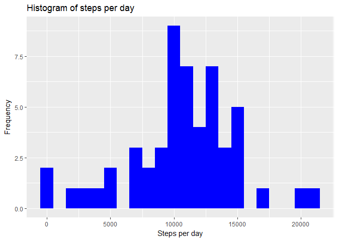
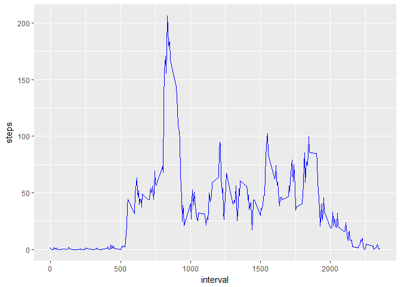
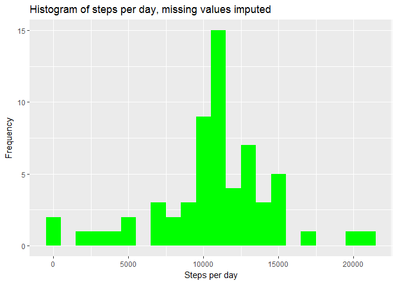
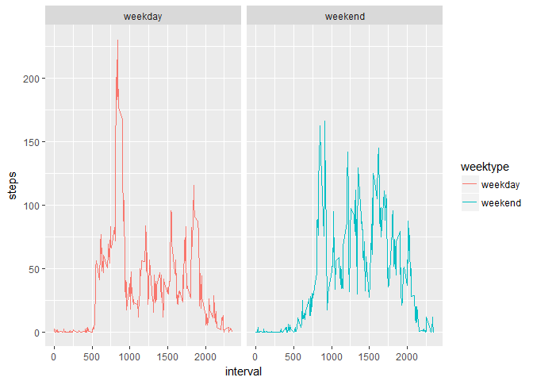

# Reproducible Research: Peer Assessment 1


## Loading and preprocessing the data

The activity.csv datafile has three columns: "steps", "date" and "interval". 

Reading in the data the columns are classified as numeric, character and integer respectively. Having read in the data to the dataset 'step', the date variable is changed into proper date formate invoking the lubridate package. Finally the step data is inspected using str() and head()


```r
step <- read.csv("activity.csv", sep=",", header=TRUE, colClasses = c("numeric", "character", "integer"))
library(lubridate)
```

```
## 
## Attaching package: 'lubridate'
```

```
## The following object is masked from 'package:base':
## 
##     date
```

```r
step$date <- ymd(step$date)
str(step)
```

```
## 'data.frame':	17568 obs. of  3 variables:
##  $ steps   : num  NA NA NA NA NA NA NA NA NA NA ...
##  $ date    : Date, format: "2012-10-01" "2012-10-01" ...
##  $ interval: int  0 5 10 15 20 25 30 35 40 45 ...
```

```r
head(step)
```

```
##   steps       date interval
## 1    NA 2012-10-01        0
## 2    NA 2012-10-01        5
## 3    NA 2012-10-01       10
## 4    NA 2012-10-01       15
## 5    NA 2012-10-01       20
## 6    NA 2012-10-01       25
```

## What is mean total number of steps taken per day?

The dplyr package is ideal for this task. First the package is invoked and the data is converted to tbl class.

```r
library(dplyr)
```

```
## 
## Attaching package: 'dplyr'
```

```
## The following objects are masked from 'package:lubridate':
## 
##     intersect, setdiff, union
```

```
## The following objects are masked from 'package:stats':
## 
##     filter, lag
```

```
## The following objects are masked from 'package:base':
## 
##     intersect, setdiff, setequal, union
```

```r
tbl_df(step)
```

```
## # A tibble: 17,568 × 3
##    steps       date interval
##    <dbl>     <date>    <int>
## 1     NA 2012-10-01        0
## 2     NA 2012-10-01        5
## 3     NA 2012-10-01       10
## 4     NA 2012-10-01       15
## 5     NA 2012-10-01       20
## 6     NA 2012-10-01       25
## 7     NA 2012-10-01       30
## 8     NA 2012-10-01       35
## 9     NA 2012-10-01       40
## 10    NA 2012-10-01       45
## # ... with 17,558 more rows
```

The piping operator can be used to pass arguments on easily and make the code more readable. The piping operator can be thought of as a 'then' argument. The mean total number of steps taken per day is stored in a new dataset called 'steps' with the following code:

```r
steps <- step %>%
  filter(!is.na(steps)) %>%
  group_by(date) %>%
  summarize(steps=sum(steps))%>%
  print
```

```
## # A tibble: 53 × 2
##          date steps
##        <date> <dbl>
## 1  2012-10-02   126
## 2  2012-10-03 11352
## 3  2012-10-04 12116
## 4  2012-10-05 13294
## 5  2012-10-06 15420
## 6  2012-10-07 11015
## 7  2012-10-09 12811
## 8  2012-10-10  9900
## 9  2012-10-11 10304
## 10 2012-10-12 17382
## # ... with 43 more rows
```
Now we can draw the histogram of the total number of steps taken per day. Here is used the ggplot2 package which is then first invoked followed by the histogram coding.

```r
library(ggplot2)
ggplot(steps, aes(x=steps))+
  geom_histogram(fill="blue", binwidth=1000)+
labs(title="Histogram of steps per day", x="Steps per day", y="Frequency")
```

<!-- -->

Then the mean and median of the steps variable is calculated, interpreted as the average number of steps taken per day in the activity data set over the period of study (53 days):

```r
mean_steps <- mean(steps$steps, na.rm=TRUE)
median_steps <- median(steps$steps, na.rm=TRUE)
sd_steps <- sd(steps$steps, na.rm=TRUE)
print(mean_steps)
```

```
## [1] 10766.19
```

```r
print(median_steps)
```

```
## [1] 10765
```

```r
print(sd_steps)
```

```
## [1] 4269.18
```
The mean and median are almost identical suggesting a highly symmetrical or non-skewed distribution of steps taken per day.The SD was also calculated as it may become useful towards answering some questions later on. It is very easy to go back and edit the research in Markdown as new ideas or needs are discovered.

At the moment we have just been ignoring missing observations, e.g. simply removing them from the data analysed. This is one of the problems we tackle next with question 4.


## What is the average daily activity pattern?

Again dplyr is very fitting to regroup the data, now around the daily activity pattern where the 'interval' variable is the key. A new dataset is created called interval using almost identical code but regrouping the data by interval averages, and then plotting the newly created 'steps' variable (should really be steps_by_interval!) using a time series or line plot with the ggplot2 package:

```r
interval <- step %>%
  filter(!is.na(steps)) %>%
  group_by(interval) %>%
  summarize(steps = mean(steps))
ggplot(interval, aes(x=interval, y=steps)) +
  geom_line(color="blue")
```

<!-- -->

To identify the exact interval with the maximum number of steps taken on the average day we can subset the dataset using the which.max() call:

```r
interval[which.max(interval$steps),]
```

```
## # A tibble: 1 × 2
##   interval    steps
##      <int>    <dbl>
## 1      835 206.1698
```
It is the 835th interval that has the maximum number of steps taken on avearge (206 steps).


## Imputing missing values

The presence of missing observations for the steps variable may introduce bias into some calculations or summaries of the data. Missing values is a censoring problem in data analysis and in particular when the reason for the data missing is non-random (see also UU). This problem has been specifically treated in the data science literature related with activity datasets as the present one. For example, Catelier et al (2005) suggest that missing observations are related with the propensity of study objects to wear the activity measuring gear. There is therefore a tendency for having more missing observations around weekends. This also suggests that the reasons for censoring are non-random. Here is adopted a very simple strategy of replacing or imputing missing observations from the interval dataset. A more refined strategy could take outset in Catelier et al's research, e.g. by imputing missing observations not only with respect to time interval, but also with respect to number of day in the week. However, that is beyond the scope of the present paper and reserved for future research. The consequences of not dealing with this problem in the analysis are answered towards the end of the paper.

First we detect the total number of missing observations present in the activity dataset by summarising the step dataset with respect to NA's:

```r
sum(is.na(step$steps))
```

```
## [1] 2304
```
Hence there are 2,304 observations with missing values out of a total of 17,568 observations. In other words 13% of observations are missing. This is a relatively high number of missing observations and there is ground to believe that the NAs could introduce a bias into the analysis, and again more so if it owes to a non-random pattern or real censoring problem.

Hence we adopt a simple strategy towards imputing missing values for number of steps. Here is used the interval subset of the data, replacing any missing value with the average for that particular interval in time and independent of the weekday etc.:

```r
step_imputed <- step
nas <- is.na(step_imputed$steps)
avg_interval <- tapply(step_imputed$steps, step_imputed$interval, mean, na.rm=TRUE, simplify=TRUE)
step_imputed$steps[nas] <- avg_interval[as.character(step_imputed$interval[nas])]
```
And now checking that the missing values have indeed been removed:

```r
sum(is.na(step_imputed$steps))
```

```
## [1] 0
```
As we get a return value of 0 this appears to be the case.

Now we repeat the code from earlier on, drawing anew the histogram for the average number of steps taken per day and recalculating the summary statistics, simply in order to compare the two samples without and with imputed data for missing values.

First we have to recalculate the summary statistics by day using the newly created step_imputed dataset:

```r
steps_imputed <- step_imputed %>%
  filter(!is.na(steps)) %>%
  group_by(date) %>%
  summarize(steps=sum(steps))%>%
  print
```

```
## # A tibble: 61 × 2
##          date    steps
##        <date>    <dbl>
## 1  2012-10-01 10766.19
## 2  2012-10-02   126.00
## 3  2012-10-03 11352.00
## 4  2012-10-04 12116.00
## 5  2012-10-05 13294.00
## 6  2012-10-06 15420.00
## 7  2012-10-07 11015.00
## 8  2012-10-08 10766.19
## 9  2012-10-09 12811.00
## 10 2012-10-10  9900.00
## # ... with 51 more rows
```


Then we can draw the histogram now with the steps_imputed data:


```r
library(ggplot2)
ggplot(steps_imputed, aes(x=steps))+
  geom_histogram(fill="green", binwidth=1000)+
labs(title="Histogram of steps per day, missing values imputed", x="Steps per day", y="Frequency")
```

<!-- -->

Finally we recalculate the mean, median and standard deviation using the steps_imputed data:

```r
mean_steps_imputed <- mean(steps_imputed$steps, na.rm=TRUE)
median_steps_imputed <- median(steps_imputed$steps, na.rm=TRUE)
sd_steps_imputed <- sd(steps_imputed$steps, na.rm=TRUE)
print(mean_steps_imputed)
```

```
## [1] 10766.19
```

```r
print(median_steps_imputed)
```

```
## [1] 10766.19
```

```r
print(sd_steps_imputed)
```

```
## [1] 3974.391
```


Summarising the results - from the histogram we see that the distribution has become even more symmetrical than the original dataset. This is not surprising as the imputation involves an averaging on the existing dataset and its original distribution hence reducing imbalance. It could suggest that this is not a real case of censoring but rather random missing data. The standard deviation has also been slightly reduced. But the last question suggests that using a more refined strategy for imputation might be more appropriate for this dataset.


## Are there differences in activity patterns between weekdays and weekends?

To solve this problem we can use mutate() and weekdays() in dplyr. First the dplyr is re-invoked:

```r
library(dplyr)
step_imputed <- mutate(step_imputed, weektype = ifelse(weekdays(step_imputed$date) == "Saturday" | weekdays(step_imputed$date) == "Sunday", "weekend", "weekday"))
step_imputed$weektype <- as.factor(step_imputed$weektype)
head(step_imputed)
```

```
##       steps       date interval weektype
## 1 1.7169811 2012-10-01        0  weekday
## 2 0.3396226 2012-10-01        5  weekday
## 3 0.1320755 2012-10-01       10  weekday
## 4 0.1509434 2012-10-01       15  weekday
## 5 0.0754717 2012-10-01       20  weekday
## 6 2.0943396 2012-10-01       25  weekday
```
Nowwe have to re-calculate the average steps by interval and differentiating by the type of day in the week. The result is to be demonstrated with a plot.

```r
interval_imputed <- step_imputed %>%
  group_by(interval, weektype) %>%
  summarise(steps = mean(steps))
ggplot(interval_imputed, aes(x=interval, y=steps, color = weektype)) +
  geom_line() +
  facet_wrap(~weektype, ncol = 2, nrow=1)
```

<!-- -->

The plots demonstrate large differences in activity patters dependent on the type of day during the week. On work days test subjects are more active in the morning and less during the daytime. During weekends test subjects start activities later, but maintain a more constant activity pattern over the day including early evening. Hence a better imputation strategy would take outset in the original data, differentiating by both these factors. 

But to round off and out of curiosity let us check this last question on the original (real or non-imputed dataset) - we just copy-paste the above code for original data:


```r
library(dplyr)
step <- mutate(step, weektype = ifelse(weekdays(step$date) == "Saturday" | weekdays(step$date) == "Sunday", "weekend", "weekday"))
step$weektype <- as.factor(step$weektype)
head(step)
```

```
##   steps       date interval weektype
## 1    NA 2012-10-01        0  weekday
## 2    NA 2012-10-01        5  weekday
## 3    NA 2012-10-01       10  weekday
## 4    NA 2012-10-01       15  weekday
## 5    NA 2012-10-01       20  weekday
## 6    NA 2012-10-01       25  weekday
```


```r
interval2 <- step %>%
  filter(!is.na(steps)) %>%
  group_by(interval, weektype) %>%
  summarise(steps = mean(steps))
ggplot(interval2, aes(x=interval, y=steps, color = weektype)) +
  geom_line() +
  facet_wrap(~weektype, ncol = 2, nrow=1)
```

<!-- -->

Indeed the differences remain. Hence it is concluded the best strategy for imputation is to make a new dataset that summarises the average steps taken both by interval and type of day in the week. 

REFERENCES
CATELLIER, D. J., HANNAN, P. J., MURRAY, D. M., ADDY, C. L., CONWAY, T. L., YANG, S., & RICE, J. C. (2005). Imputation of missing data when measuring physical activity by accelerometry. Medicine and science in sports and exercise, 37(11 Suppl), S555.

Unknown author(Unknown year).Missing data imputation. Chapter 25. Unknown source publication. http://www.stat.columbia.edu/~gelman/arm/missing.pdf
